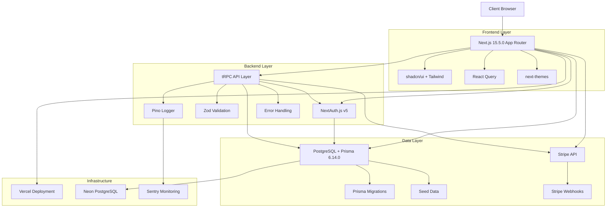

# Architecture Overview

This document provides a high-level overview of the Next.js SaaS Template architecture, design
decisions, and system components.

## System Architecture



## Core Principles

### 1. Type Safety First

- **TypeScript strict mode** throughout the entire application
- **End-to-end type safety** with tRPC from database to frontend
- **Runtime validation** with Zod for all external inputs
- **Branded types** for sensitive data like user IDs and API keys

### 2. Security by Design

- **Input validation** at every boundary using Zod schemas
- **Authentication** with NextAuth.js v5 and secure session management
- **Authorization** with role-based access control (RBAC)
- **Rate limiting** on public endpoints
- **Secure headers** and CSRF protection

### 3. Developer Experience

- **Hot reloading** with Next.js development server
- **Type-safe APIs** with tRPC for immediate feedback
- **Comprehensive testing** with Vitest and Playwright
- **Code quality** enforced with ESLint and Prettier
- **Git hooks** for pre-commit validation

### 4. Production Ready

- **Performance optimized** with Server Components and caching
- **Observability** with structured logging and monitoring
- **Error boundaries** and graceful error handling
- **Database migrations** with Prisma
- **CI/CD ready** with GitHub Actions templates

## Technology Stack

### Frontend Architecture

- **Framework**: Next.js 15.5.0 with App Router
- **Language**: TypeScript 5.5.4+ (strict mode)
- **Styling**: Tailwind CSS 3.4+ with shadcn/ui components
- **State Management**: React Query (TanStack Query) for server state
- **Theming**: next-themes for dark/light mode support
- **Icons**: Lucide React for consistent iconography

### Backend Architecture

- **API Layer**: tRPC 11.x for type-safe APIs
- **Authentication**: NextAuth.js v5 with JWT sessions
- **Database**: PostgreSQL 15+ with Prisma ORM 6.14.0
- **Validation**: Zod 3.23+ for schema validation
- **Logging**: Pino for structured logging
- **Payments**: Stripe SDK for billing and subscriptions

### Development Tools

- **Testing**: Vitest (unit/integration) + Playwright (e2e)
- **Code Quality**: ESLint + Prettier with strict rules
- **Git Hooks**: Husky + lint-staged for pre-commit checks
- **Package Manager**: pnpm for faster, more efficient installs

## Directory Structure

```
├── app/                    # Next.js App Router (pages only)
├── src/
│   ├── components/        # React components
│   │   ├── ui/           # shadcn/ui base components
│   │   ├── layout/       # Layout-specific components
│   │   ├── forms/        # Form components
│   │   └── charts/       # Data visualization components
│   ├── server/           # Server-side code
│   │   ├── auth/         # Authentication configuration
│   │   ├── db/           # Database utilities and connection
│   │   └── api/          # tRPC routers and procedures
│   ├── lib/              # Utility functions and configurations
│   │   ├── utils/        # General utility functions
│   │   ├── env.mjs       # Environment variable validation
│   │   ├── auth.ts       # Auth configuration
│   │   └── db.ts         # Database connection setup
│   ├── styles/           # Global CSS and Tailwind config
│   ├── tests/            # Test utilities and setup files
│   └── types/            # TypeScript type definitions
├── prisma/               # Database schema and migrations
├── docs/                 # Project documentation
├── scripts/              # Build and deployment scripts
└── infra/                # Infrastructure as code
```

## Data Flow

### Authentication Flow

1. User initiates login via NextAuth.js
2. Provider authenticates user (email/OAuth)
3. JWT session token created and stored
4. User context available in all Server Components
5. Middleware protects routes based on authentication state

### API Request Flow

1. Client makes request via tRPC client
2. Request validated by Zod schema
3. Authentication checked via NextAuth session
4. Authorization verified based on user role/organization
5. Business logic executed with type safety
6. Database operations through Prisma
7. Response serialized and returned to client

### Billing Flow

1. User selects subscription plan
2. Stripe Checkout session created
3. User completes payment
4. Stripe webhook updates database
5. User gains access to premium features
6. Usage metered and billed accordingly

## Security Architecture

### Authentication & Authorization

- **Multi-factor authentication** support
- **Role-based access control** (Owner, Admin, Member)
- **Organization-scoped permissions**
- **Session management** with secure JWT tokens

### Input Validation

- **Zod schemas** for all API endpoints
- **Type-safe forms** with React Hook Form
- **SQL injection prevention** via Prisma
- **XSS protection** with proper escaping

### Infrastructure Security

- **HTTPS everywhere** with secure headers
- **CSRF protection** built into Next.js
- **Rate limiting** on public endpoints
- **Environment variable validation**

## Performance Considerations

### Frontend Optimization

- **Server Components** by default for better performance
- **Client Components** only when necessary
- **Image optimization** with Next.js Image component
- **Font optimization** with next/font

### Database Optimization

- **Proper indexing** for frequently queried fields
- **Connection pooling** for database connections
- **Query optimization** with Prisma insights
- **Caching strategies** for expensive operations

### Monitoring & Observability

- **Structured logging** with request IDs
- **Error tracking** with Sentry integration
- **Performance monitoring** with Web Vitals
- **Database query monitoring** with Prisma logs

## Deployment Architecture

### Vercel Deployment (Recommended)

- **Automatic deployments** from Git branches
- **Preview deployments** for pull requests
- **Edge runtime** for optimal performance
- **Built-in analytics** and monitoring

### Docker Deployment (Alternative)

- **Multi-stage builds** for optimized images
- **Health checks** for container orchestration
- **Environment-specific configurations**
- **Database migrations** in deployment pipeline

## Scalability Considerations

### Horizontal Scaling

- **Stateless server design** for easy scaling
- **Database connection pooling**
- **CDN integration** for static assets
- **Microservices ready** architecture

### Vertical Scaling

- **Efficient database queries**
- **Proper caching strategies**
- **Memory optimization**
- **CPU-intensive task delegation**

## Future Considerations

### Planned Enhancements

- **Multi-tenancy** support for enterprise customers
- **Advanced analytics** dashboard
- **API rate limiting** per organization
- **Audit logging** for compliance requirements
- **Internationalization** (i18n) support
- **Progressive Web App** (PWA) capabilities

### Technology Evolution

- **React Server Components** adoption
- **Streaming** for improved user experience
- **Edge computing** utilization
- **AI/ML integration** possibilities

This architecture provides a solid foundation for building scalable, secure, and maintainable SaaS
applications while maintaining developer productivity and code quality.
